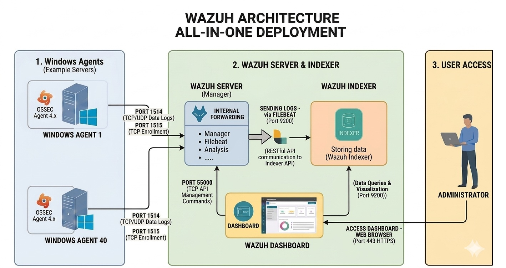

#  Wazuh Deployment 
## 1. Architecture
The system is deployed as an **All-in-one Centralized Manager**. This setup was chosen to provide robust monitoring for organisation's infrastructure while maintaining ease of management.
Why All-in-One instead of a distributed cluster: This deployment targets a small-to-mid infrastructure (up to 40 endpoints). At this scale, a distributed cluster (separate Manager, Indexer nodes, and Dashboard) adds operational overhead. If agent count or log volume grows significantly beyond this range, migrating to a distributed Indexer cluster is the natural next step, since Wazuh supports scaling the Indexer independently of the Manager.
* **Wazuh Version:** 4.14.3
* **Operating System:** Ubuntu 22.04.5 LTS
* **Deployment Method:**  Wazuh's official installation assistant script, single-node mode.

## 2. Hardware Specifications
* **Instance:** 4 vCPUs, 8 GB RAM
* **Storage:** 500GB SSD
* **Estimated Capacity:** Up to 40 active agents with 60-day log retention.

**Trade-off note**: the 60-day retention window is a storage-driven constraint, not a design preference — at this agent count, log volume from FIM, Sysmon, and Windows Security events would otherwise fill the 150 GB allocation within a short period of time.

## 3. Architecture Diagram
The diagram illustrates the three logical zones of the deployment:

| Component | Port | Purpose |
|---|---|---|
| Agent → Server | 1514 (TCP/UDP) | Log forwarding |
| Agent → Server | 1515 (TCP) | Enrollment |
| Server → Indexer | 9200 | Filebeat → Indexer API |
| Dashboard ↔ Server | 55000 (TCP) | Management API |
| User → Dashboard | 443 (HTTPS) | Web access |

## 4. References
[`Wazuh Installation Guide`](https://documentation.wazuh.com/current/installation-guide/index.html)
