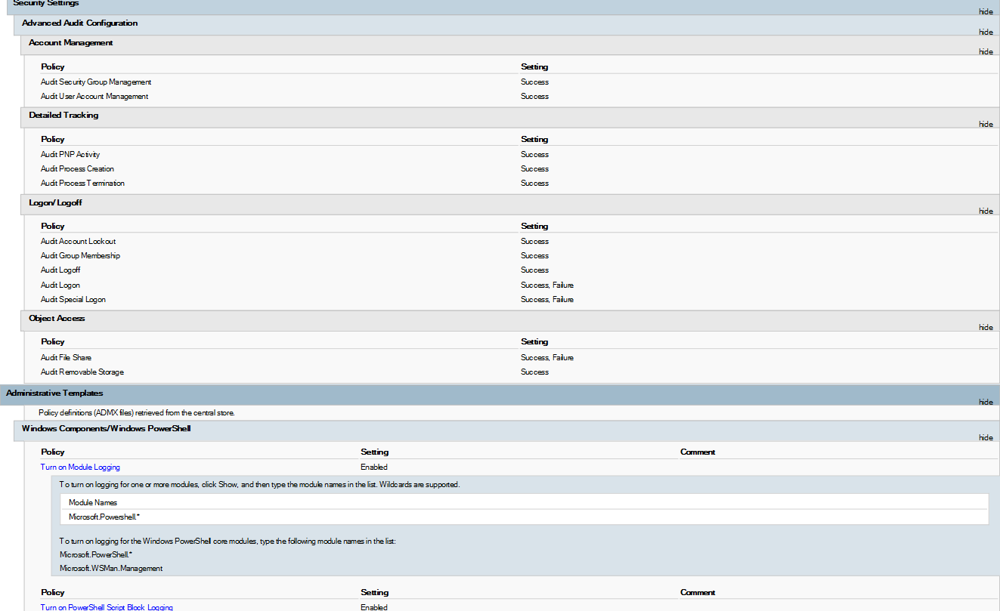

# Endpoint Visibility & Telemetry Enrichment 

## Overview

This module focuses on the initial deployment and hardening of Windows endpoints. The goal is to transform a standard Windows host into a high-fidelity data source by installing the Wazuh agent and enriching the system with advanced telemetry (Sysmon & Audit Policies). Without this foundational layer, the SIEM remains "blind" to sophisticated attack techniques like process injection, lateral movement, or obfuscated PowerShell execution.

## 1. GPO Advanced Audit Policy & PowerShell Logging 

Standard Windows logging is insufficient for security forensics. We apply a hardened Audit Policy to capture critical event IDs:

* `Process Creation (Event ID 4688)`: Enhanced with "Include Command Line" visibility. This allows us to see the exact arguments passed to a process (e.g., detecting an encoded PowerShell command or a malicious net user addition).
* `PowerShell Script Block Logging (Event ID 4104)`: Captures the actual code executed by PowerShell, even if it is obfuscated or run entirely in memory, bypassing traditional file-based detection.
* `Account Management`: Strict monitoring for unauthorized user creation, group membership changes, or privilege escalation attempts.
* `Logon/Logoff Events`: Crucial for identifying Lateral Movement patterns via RDP, SMB, or WMI sessions across the domain.
* `Object Access`: Monitoring `Removable Storage` to detect potential data exfiltration via USB devices.

Note: These policies are the "eyes" of the Wazuh agent. Without them, the SIEM would only see that an app started, but not what it actually did.

*Figure 1: GPO Report showing enabled policies for `Process Creation`, `Account Management`, and `PowerShell Module/Script Block Logging`.*

## 2. Sysmon Telemetry Enrichment

System Monitor (Sysmon) provides deep kernel-level visibility that standard Windows logs miss.
* `Configuration Source`: This deployment utilizes the official [SwiftOnSecurity/sysmon-config](./sysmon/sysmon_config.xml)

`Key Capabilities`:
* `Process Hashing`: Generates SHA256 hashes for every executable, enabling automated YARA scanning and VirusTotal lookups.
* `Network Connections`: Logs every outbound connection (IP/Port) made by local processes.
* `Parent-Child Relationships`: Essential for detecting "living-off-the-land" attacks (e.g., word.exe spawning powershell.exe).

### Sysmon Deployment via Group Policy (GPO)

To ensure consistent telemetry across the entire domain, Sysmon is deployed using Active Directory Group Policy. 

`Deployment Strategy`:
* `Storage`: The [`sysmon64.exe`](https://learn.microsoft.com/en-us/sysinternals/downloads/sysmon) binary and the [`sysmonconfig.xml (SwiftOnSecurity)`](https://github.com/SwiftOnSecurity/sysmon-config.git) are placed on a shared folder where all endpoints have read access.
* `GPO Type`: Computer Configuration -> Policies -> Windows Settings -> Scripts (Startup).
* `Logic`: A startup PowerShell script checks if Sysmon is installed; if not, it triggers the installation using the predefined configuration.
* `Deployment Script`: [`sysmon_install_script.ps1`](./sysmon/sysmon_install_script.ps1)

## 3. Wazuh Agent Deployment via Group Policy (GPO)

`Deployment Strategy`:
* `Storage`: The [`wazuh-agent.msi`](https://packages.wazuh.com/4.x/windows/wazuh-agent-4.14.3-1.msi) binary is placed on a shared folder where all endpoints have read access.
* `GPO Type`: Computer Configuration -> Policies -> Windows Settings -> Scripts (Startup).
* `Logic`: A startup PowerShell script checks if wazuh service is installed; if not, it triggers the installation using the predefined configuration.
* `Deployment Script`: [`wazuh-agent_installation.ps1`](./wazuh-agent/wazuh-agent_installation.ps1)

## 4. Sysmon & Wazuh Centralized Integration (agent.conf)

Instead of manual local configuration, Wazuh's Centralized Configuration capability allows managing telemetry collection for hundreds of endpoints from a single file on the Wazuh Manager.
`Configuration Path (Manager)`:
/var/ossec/etc/shared/default/[`agent.conf`](./wazuh-agent/agent.conf)
By adding this to the centralized file, all agents in the group automatically start collecting Sysmon data.