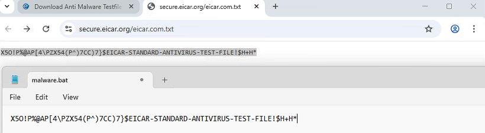
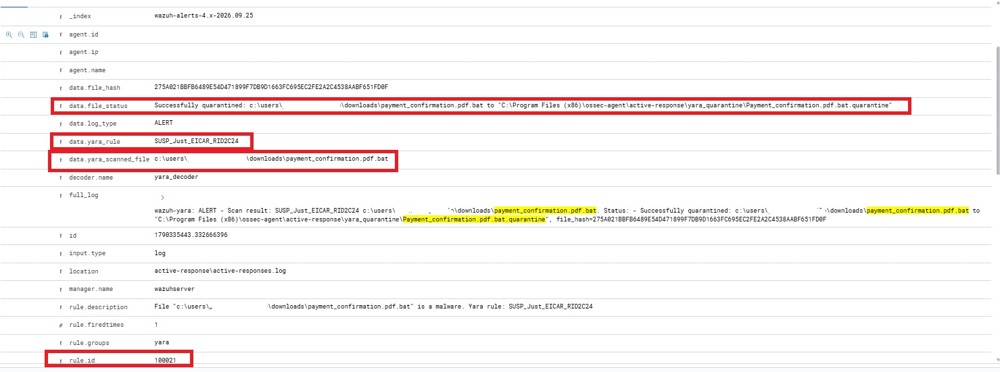
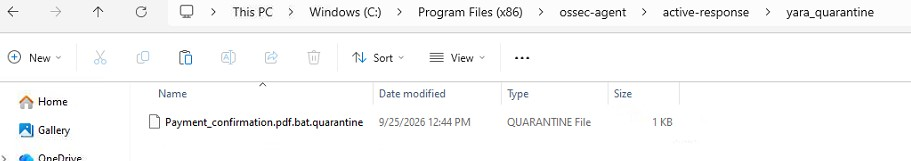

# YARA Malware Detection & Active-Response

## Overview

This module automates the detection of malicious files within the infrastructure. By integrating YARA with the Wazuh Active Response engine, the system performs real-time signature-based scanning on any file creation or modification event.

## System Architecture and Workflow

The integration follows a fully automated pipeline to ensure that detection signatures are always current and deployed across all endpoints.

1.  **Threat Intel Ingestion**: A Python script pulls the latest curated rules from the **Valhalla API**.
2.  **Wazuh to YARA log parsing**: A batch script is used as a "bridge" between SIEM and YARA engine
3.  **Centralized Distribution**: A PowerShell script (via GPO) copies yara executable and synchronizes these rules to all domain-joined assets.
4.  **Real-Time Trigger**: Wazuh FIM (File Integrity Monitoring) identifies a suspicious file event.
5.  **Active Response**: The agent executes the YARA scanner and reports findings back to the Manager.

## Components

### 1. Threat Intel Feed (Python) 
To maintain high detection accuracy, an automated pipeline is implemented using the Valhalla API.
**Script**: [`download_yara_rules.py`](./yara/download_yara_rules.py)
**Dependency**: [`valhallaAPI_module`](./yara/valhallaAPI_module.txt) (requires `valhallaAPI` module)
**Logic**: Authenticates with the Valhalla Public API and downloads the latest community ruleset to the GPO deployment share.

Note: The API key in download_yara_rules.py is NextronSystems' public demo key for the Valhalla API, documented officially in both the valhallaAPI repository and Wazuh's own YARA integration guide.

### 2. Wazuh Integration (Batch) 
**Script**: [`yara.bat`](./yara/yara.bat) 
**Function**: Acts as the "bridge" between the SIEM and the scanner. Parses the JSON alert from Wazuh and passes the file path to the YARA engine for analysis.

### 3. GPO Deployment (PowerShell) 
To ensure scalability, YARA binaries and rules are managed via Group Policy.
**Script**: [`yara_deployment_script`](./yara/yara_deployment_script.ps1)
**Logic**: The script only copies files if they are missing or if the source timestamp is newer than the local copy, saving network bandwidth.

## FIM Configuration (Centralized via `agent.conf`)

### 1. Endpoint Monitoring Setup 
Access [`/var/ossec/etc/shared/<default>/agent.conf`](./wazuh-manager/agent.conf). Replace <default> with the group name agents belong to. If no groups are created, <default> is the default group name. This file is used to centrally manage FIM (File Integrity Monitoring) settings across all Windows assets.
**Logic**: In addition to default FIM monitoring, this configuration targets common attack vectors by specifically watching directories where internet-sourced files are typically executed (e.g., Downloads,Temp).
**Monitored Extensions**: It is tuned to trigger on file creation or modification of executables (`.exe`, `.msi`), scripts (`.ps1`, `.vbs`, `.bat`,`.js`), shortcuts (`.lnk`) and Office macros (`.docm`, `.xlsm`, `.pptm`).

### 2. SIEM Alerting 
Custom rules are created to generate high-priority alerts when files with these specific extensions are created or modified. 
**FIM Rules** [`/var/ossec/etc/rules/local_rules.xml`](./wazuh-manager/FIM_rules.xml) 
`Note:` On the Wazuh Manager, FIM_rules.xml, yara_rules.xml, are all concatenated into a single /var/ossec/etc/rules/local_rules.xml. They are kept as separate files in this repository for readability.

## Active Response and Malware Alerting 

### 1. Behaviour Configuration

Active response actions are configured in wazuh manager [`ossec.conf`](./wazuh-manager/ossec.conf) file. This configuration is split into two logical parts:
  * Command definition: This block registers the yara.bat script within the Wazuh engine, allowing it to be called by the Active Response module.

  * Active Response Policy:This block links the previously defined command to specific security events.
      **Trigger**: Automatically executes when FIM rules (`100001` through `100008`) are fired.
      **Location**: Executed local on the agent that triggered the alert.

### 2. YARA Malware Alerting

In order for Wazuh to transform raw YARA output into structured security alerts, custom decoders and rules are implemented:
  * Custom decoders - [`/var/ossec/etc/decoders/local_decoder.xml`](./yara/wazuh_yara_decoders.xml)
  * Custom Rules -  [`/var/ossec/etc/rules/local_rules.xml`](./yara/wazuh_yara_rules.xml)

## Wazuh Alerts & Proof of Concept
 To verify the integration, an EICAR anti-malware test file was created as `malware.bat` 

 

 Figure 1: Malware file creation. 
 
 The following flow demonstrates the system's response:

### 1. Malware Detection (YARA Scan) & Automated Quarantine Action
When the file is created, Wazuh triggers the Active Response. The YARA engine identifies the threat based on the SUSP_Just_EICAR signature.
Immediately after detection, the yara.bat script renames and moves the malicious file to a secure location to prevent execution.

Figure 2: Wazuh alert showing the specific YARA rule triggered (rule.id: 100021).

### 2. Endpoint Evidence
On the local agent, the original file from \Downloads has been removed and replaced by a .quarantine file in the protected directory.

Figure 3: View of the isolated file in the YARA quarantine folder.