# Shuffle SOAR Integration — Enrichment, Correlation & Automated Response

## Overview

While Chapter 3 covers detection and remediation that happen entirely on the endpoint (FIM triggers a local YARA scan, and a confirmed match is quarantined by the agent itself), this module extends the pipeline into Shuffle SOAR to handle everything a single endpoint script cannot: cross-referencing a file against external threat intelligence (VirusTotal), reconstructing the sequence of events around a suspicious file across multiple alert sources, and generating a human-readable incident report via a locally hosted LLM (Ollama). No data leaves the local network at any point in this module. 
VirusTotal lookups query only a file hash, never file content, and the LLM itself runs on-premises.

Three independent Shuffle workflows make up this module, each triggered by a different Wazuh rule (or rule group) and serving a distinct purpose. They are documented separately below:

## Shuffle SOAR Deployment (Docker Compose)

### Hardware Specifications
* **Instance:** 12 vCPUs, 16 GB RAM 
* **Operating System:** Ubuntu 22.04.5 LTS
* **Storage:** 500 GB SSD 

**Trade-off note**: Shuffle's OpenSearch backend runs with `bootstrap.memory_lock=true` and an 8 GB memory limit (see `docker-compose.yml`). Against 16 GB total RAM, this leaves roughly 7 GB of headroom for `orborus` to spawn worker containers during concurrent workflow executions.

Shuffle is self-hosted via Docker Compose, alongside its own OpenSearch backend.

### Docker Engine Installation
**Method:** Ubuntu's own repository package (`docker.io`). Applied identically on both the Shuffle and Ollama servers.
**Prerequisite:** APT proxy configured in /etc/apt/apt.conf.d/ directory
`docker.io` is pulled directly from Ubuntu's standard repositories.

```bash
#### Step 1 — Install Docker Engine + Compose v2 plugin
sudo apt install docker.io docker-compose-v2 -y

#### Step 2 — Enable and start the Docker service
sudo systemctl enable --now docker

#### Step 3 — Prepare the working directory
mkdir ~/shuffle && cd ~/shuffle   # or ~/ollama, depends on the server.

```

* **Shuffle Version:** [2.2.1] (pinned at deployment; `docker-compose.yml` uses `:latest` tags, so the version running may drift on `docker compose pull`)
* **Compose file**: [`docker-compose.yml`](./shuffle_server_configuration/docker-compose.yml)
* **Environment file**: [`env.template`](./shuffle_server_configuration/env.template)
* **Services**:
      * `frontend` / `backend` — the Shuffle web UI and API.
      * `orborus` — Shuffle's worker orchestrator; spawns the containers that actually execute each workflow node.
      * `opensearch` — Shuffle's own datastore.

`env.template` intentionally documents only the variables added on top of Shuffle's own installer defaults. In this deployment, there are only the corporate proxy settings (`HTTP_PROXY`, `NO_PROXY`, and their lowercase equivalents) required for outbound calls to the VirusTotal API from behind the network's proxy. Every other variable consumed by `docker-compose.yml` is populated by Shuffle's default installation process and does not need to be restated here.

## OLLAMA Deployment (Docker Compose)

### Hardware Specifications
* **Instance:** 12 vCPUs, 16 GB RAM 
* **Operating System:** Ubuntu 22.04.5 LTS
* **Storage:** 500 GB SSD 

Ollama is self-hosted via Docker Compose. No web UI is deployed on this host — the inference API (port `11434`) is only reachable from the Shuffle server, per the pipeline's network design; interaction happens exclusively through the Shuffle workflow nodes (`ollama_alert_interpretation.py`, `ai_threat_summary.py`), not through manual/interactive use.

### Docker Engine Installation
**Method:** Ubuntu's own repository package (`docker.io`). Applied identically.
**Prerequisite:** APT proxy configured in /etc/apt/apt.conf.d/ directory. # `Note: For a complete isolation, APT proxy settings must be disabled after ollama installation.`

* **Ollama Version:** [0.32.9] (pinned at deployment; `docker-compose.yml` uses no explicit tag on `ollama/ollama`, so the version may drift on `docker compose pull`)
* **LLM model:**  llama3:latest
* **Compose file**: [`docker-compose.yml`](./ollama_server_configuration/docker-compose.yml)
* **Network isolation:** This host has no outbound internet access by design, consistent with the project's privacy-first model, No `env.template` or proxy configuration exists here. The `ollama/ollama` image was (pulled via temporary proxy access during initial setup, then isolated).
```bash
docker exec -e HTTP_PROXY=http://IP_PROXY:PORT -e HTTPS_PROXY=http://IP_PROXY:PORT ollama ollama pull llama3
```

**Trade-off note:** The model runs on CPU (no GPU present). `llama3` (8B) response latency directly affects the Shuffle workflow's end-to-end alert-processing time.

## System Architecture and Workflow

The project architecture is designed as a defense-in-depth mechanism as follows: 

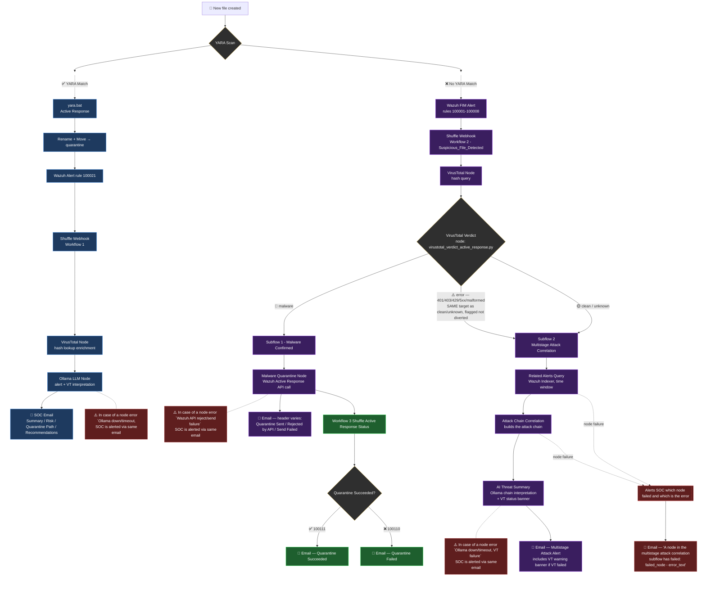


### Workflow 1 — YARA_Malware_Detection_&_Response

 <a href="./Shuffle_Workflows/Screenshots/YARA_Malware_Detection&Response.png">
  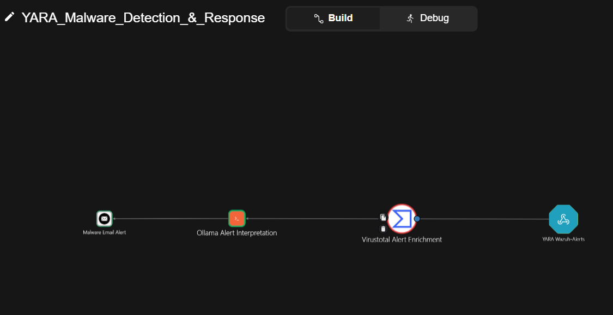
</a>

Figure 1: YARA_Malware_Detection_&_Response Workflow

**Trigger**: Wazuh alert rule `100021` (`wazuh-yara: ALERT - Scan result...`) — the same YARA match alert documented in Chapter 3. By the time this workflow fires, detection and quarantine are already complete: the agent-side `yara.bat` active response has both identified the malware and moved it to quarantine, without waiting on Shuffle. This workflow performs no decision-making and no remediation, its only job is to turn a terse Wazuh alert into a report a SOC analyst can act on immediately, enriched with an independent VirusTotal hash check for context.

1. Wazuh webhook delivers the `100021` alert to Shuffle.
2. A VirusTotal hash lookup enriches the alert with the file's known reputation (detection count, threat classification), for context alongside the local YARA verdict.
3. [`ollama_alert_interpretation.py`](./Shuffle_Workflows/01_Workflow_YARA_Malware_Detection&Response/ollama_alert_interpretation.py) combines both sources into a single prompt and asks a local Ollama instance (`llama3`) to produce a four-section report — Summary, Risk, Quarantine Location, Recommendations — then emails it to the SOC.

##### Workflow 1 Alerting - Proof of Concept

<a href="./Shuffle_Workflows/01_Workflow_YARA_Malware_Detection&Response/proof_of_concept/workflow1_malware_alert.jpg">
  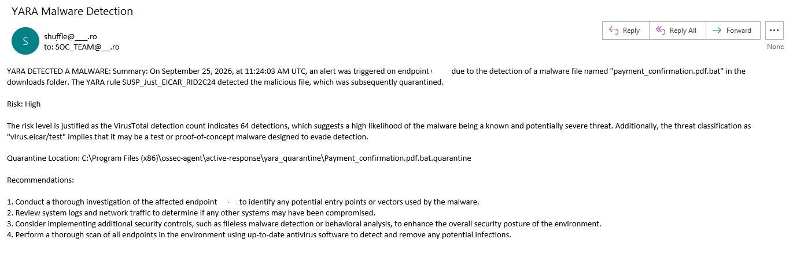
</a>

Figure 2: Workflow 1 Alerting - Proof of Concept 

### Workflow 2 — Suspicious File Detected (VirusTotal Verdict & Branching)

 <a href="./Shuffle_Workflows/Screenshots/Suspicious_File_detected.png">
  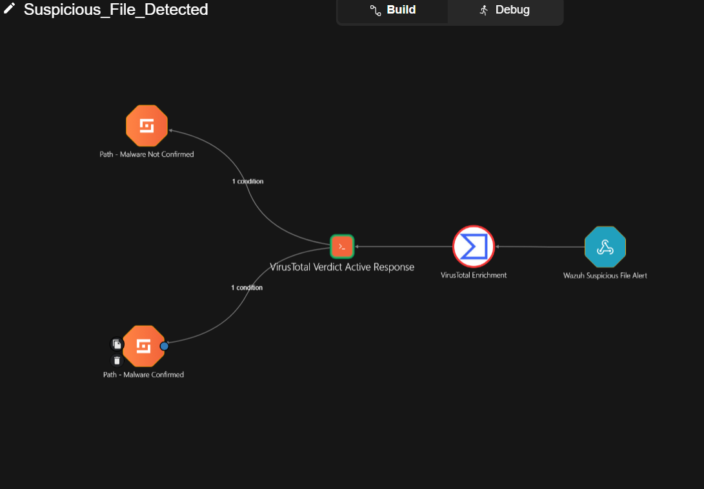
</a>

Figure 3: Suspicious File Detected Workflow 

**Trigger**: Wazuh FIM rules `100001` through `100008`. It addresses the raw file creation/modification events from Chapter 3's FIM configuration, independent of whether a YARA rule matched. This is the pipeline's second detection path: files that don't match any local YARA signature but were still created or modified in a monitored location (Downloads, Temp) are still worth checking against external threat intelligence before being dismissed.

1. Wazuh webhook delivers the triggering FIM alert to Shuffle.
2. A VirusTotal hash lookup checks the file's hash against VirusTotal's database.
3. [`virustotal_verdict_active_response.py`](./Shuffle_Workflows/02_Workflow_Suspicious_File_Detected/virustotal_verdict_active_response.py) classifies the result into one of four verdicts, based on the lookup's HTTP status code:
   * **`malware`** — HTTP 200 with detections at or above `MALICIOUS_THRESHOLD = 4`. The threshold balances two failure modes: too low, and a single misconfigured or overly aggressive vendor engine triggers a false positive; too high, and a novel sample that only a handful of engines have signatures for yet slips through as "clean."
   * **`clean`** — HTTP 200, below the threshold.
   * **`unknown`** — HTTP 404: the hash has never been submitted to VirusTotal. Kept distinct from `clean` deliberately. A 404 says nothing about the file's safety, whereas a 200 with 0 detections means the hash is known and confirmed clean.
   * **`error`** — any other status (401/403 auth failure, 429 rate limit, 5xx outage, or a missing/non-numeric status field). The lookup did not complete, so the file cannot be classified either way. This error is sent through an email node  for manual SOC review, rather than defaulting to `clean` or `malware`.
4. Based on the verdict, execution branches into one of two independent subflows:

#### Subflow 1 — Malware Confirmed

 <a href="./Shuffle_Workflows/Screenshots/Malware_Confirmed_Subflow.png">
  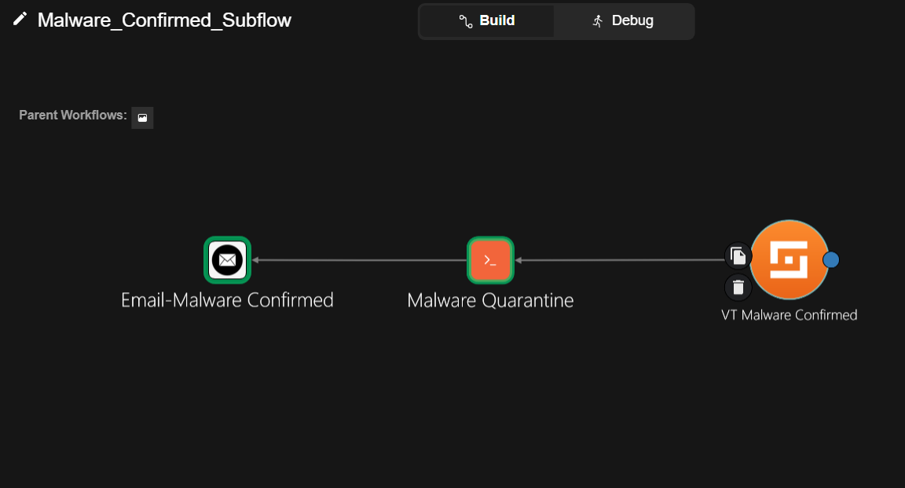
</a>

Figure 4: Malware Confirmed Subflow 

Runs only on a `malware` verdict.

[`malware_quarantine.py`](./Shuffle_Workflows/02_Workflow_Suspicious_File_Detected/02-01_Subflow_malware_confirmed/malware_quarantine.py) sends the quarantine command to the reporting agent via the Wazuh Manager API, authenticating first to obtain a bearer token, then issuing a `PUT /active-response` call with `"command": "!active_response_quarantine.bat"`. This is the same  quarantine path from Chapter 3's `yara.bat`.

This node only confirms that the command was *sent* successfully, not that the file was actually moved on the endpoint. That confirmation is handled entirely by Workflow 3, below.

**Endpoint script**: [`active_response_quarantine.bat`](./Shuffle_Workflows/02_Workflow_Suspicious_File_Detected/02-01_Subflow_malware_confirmed/active_response_quarantine.bat)
Runs on the agent once triggered. Reads the target file path from the Active Response payload, confirms the file still exists on disk (another AV/EDR agent may have already removed it), then moves and renames it into the quarantine folder, capturing the specific PowerShell error on failure rather than a generic "failed" status. Writes a `QUARANTINE MALWARE STATUS ...` line to `active-responses.log` either way, which becomes the input to Workflow 3.

##### Subflow 1 Alerting - Proof of Concept

<a href="./Shuffle_Workflows/02_Workflow_Suspicious_File_Detected/02-01_Subflow_malware_confirmed/proof_of_concept/subflow1_alert.jpg">
  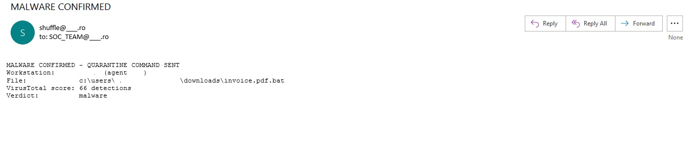
</a>

Figure 5: Subflow 1 Alerting - Proof of Concept

#### Subflow 2 — Multistage Attack Correlation

<a href="./Shuffle_Workflows/Screenshots/Multistage_Attack_Correlation_Subflow.png">
  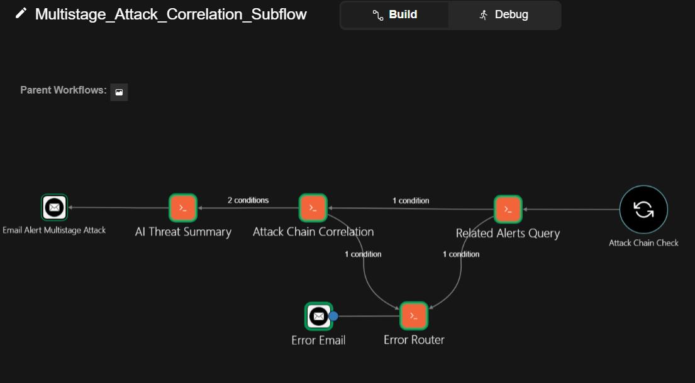
</a>

Figure 6: Multistage Attack Correlation Subflow 

Runs on VirusTotal `clean`, `unknown` or `error`; cases where hash reputation alone cannot rule out a threat, since neither result excludes a new or modified malicious file.

1. [`related_alerts_query.py`](./Shuffle_Workflows/02_Workflow_Suspicious_File_Detected/02-02_Subflow_multistage_attack/related_alerts_query.py) queries the Wazuh Indexer (OpenSearch) directly for alerts from the same agent within a time window around the triggering event: 3 minutes before (to catch the process that wrote the file) and 5 minutes after (to catch delayed execution, since a downloaded file is often opened minutes after landing on disk, not immediately). To keep the chain focused on relevant activity and the payload within Shuffle's limits, only alerts with `rule.level >= 4` are retrieved, capped at 100 results sorted chronologically. Each alert, whether sourced from Sysmon or FIM/syscheck, is normalized into one flat schema, since the two log sources place equivalent fields under different keys.
2. [`attack_chain_correlation.py`](./Shuffle_Workflows/02_Workflow_Suspicious_File_Detected/02-02_Subflow_multistage_attack/attack_chain_correlation.py) compares each alert in the time window against every other alert. When two alerts share an indicator: `file hash`, `file path`, `process lineage (PID/PPID)`, `destination IP`, or `user`, a link is recorded between them. Alerts linked together, whether directly or through one or more intermediate alerts (A linked to B, B linked to C, all three end up grouped together even though A and C share nothing directly), are grouped into a single chain. Links are weighted: a shared `hash`, a shared `file/process` directly observed on at least one side, a `parent-child` process relationship, or a shared `destination IP` is strong enough to group two alerts into a chain on its own. A shared `user`, a shared `process ID`, or a `filename` that appears only as text inside a command line on both sides (with neither alert showing the file as a directly observed artifact) is weaker evidence. It never forms a chain by itself, but once two alerts are already grouped via a strong link, this weaker evidence still enriches that chain's score and is included as supporting context in the final report. Each resulting chain receives a 0–100 risk score and a categorical verdict (`LOW` through `CRITICAL`).    
3. [`ai_threat_summary.py`](./Shuffle_Workflows/02_Workflow_Suspicious_File_Detected/02-02_Subflow_multistage_attack/ai_threat_summary.py) takes the ranked chains and renders the highest-risk one(s) as a natural-language SOC report via Ollama. The Ollama answer format is a five-section brief (Verdict, What Happened, IOC, Commands Executed, Recommended Action), explicitly instructed to ground every claim in the evidence provided rather than infer relationships from alert ordering alone. The VirusTotal result from step 2 of the parent flow is passed in as explicit context, with the model instructed not to treat a `clean` or `unknown` VT verdict as proof of safety by itself if the behavioral evidence says otherwise.

##### Subflow 2 Alerting - Proof of Concept

<a href="./Shuffle_Workflows/02_Workflow_Suspicious_File_Detected/02-02_Subflow_multistage_attack/proof_of_concept/multistage_atack_email_alert.jpg">
  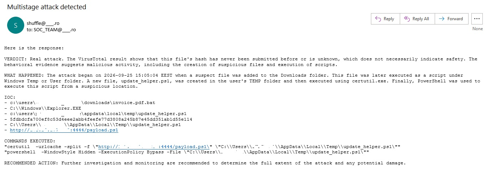
</a>

Figure 7: Subflow 2 Alerting - Proof of Concept

### Workflow 3 — Shuffle Active Response Quarantine Status

<a href="./Shuffle_Workflows/Screenshots/Shuffle_Active_Response_Quarantine_Status.png">
  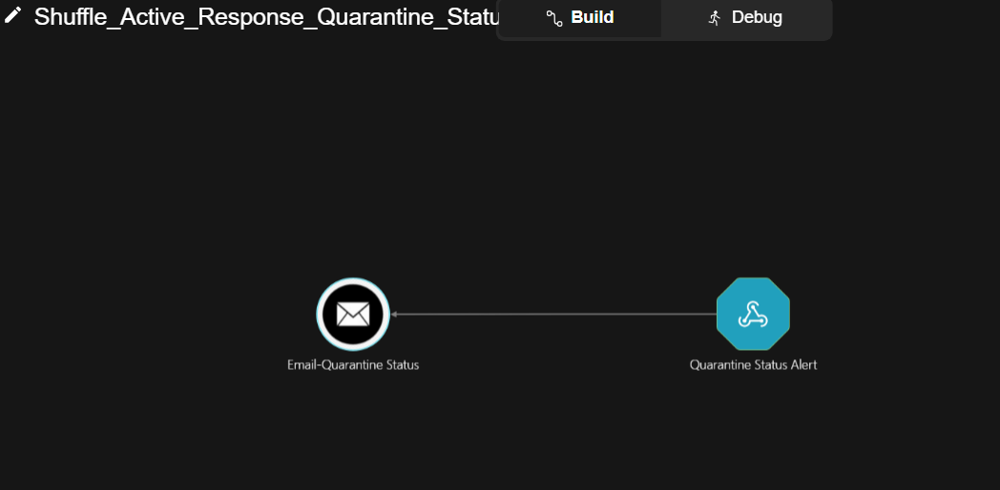
</a>

Figure 8: Shuffle Active Response Quarantine Status Workflow 

**Trigger**: Wazuh alert rules `100110` (quarantine failed) / `100111` (quarantine succeeded). This represents the result of the active-response process from Subflow 1. 
Each rule fires based on  `QUARANTINE MALWARE STATUS ...` line match, written by `active_response_quarantine.bat` on the endpoint and routes to its own Shuffle webhook. The SOC team is then notified by email  of the final confirmed outcome.

#### Quarantine Confirmation — Rules & Decoder
Custom rules and a decoder translate the endpoint's `active-responses.log` line into structured Workflow 3 alerts:
* Custom decoder — [`quarantine_decoder.xml`](./wazuh_integration/quarantine_decoder.xml)
* Custom rules — [`quarantine_status_rules.xml`](./wazuh_integration/quarantine_status_rules.xml)

##### Workflow 3 - Alerting Proof of Concept
###### 1. Quarantine operation succeeded

<a href="./Shuffle_Workflows/03_Workflow_Shuffle_Active-Response_Quarantine_Status/proof_of_concept/quarantine_succeeded.jpg">
  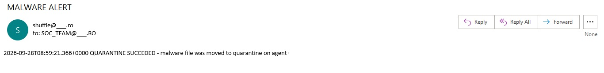
</a>

Figure 9: Workflow 3 Alerting - Proof of Concept - Success

###### 2. Quarantine operation failed

<a href="./Shuffle_Workflows/03_Workflow_Shuffle_Active-Response_Quarantine_Status/proof_of_concept/quarantine_failed.jpg">
  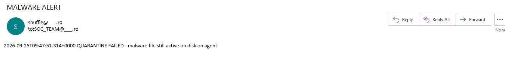
</a>

Figure 10: Workflow 3 Alerting - Proof of Concept - Fail

### Workflow Credentials

All credentials consumed by the node scripts (`wazuh_indexer_user`, `wazuh_indexer_pass`, `wazuh_manager_api_user`, `wazuh_manager_api_user_password`) are stored as Shuffle Variables, scoped to the organization, and referenced in code exclusively via the `$variable_name` syntax. They are not hardcoded in a node's script body. 

## Workflows Error Handling

**Terminal nodes never `raise`.** Any node whose only downstream connection is the SOC email node on the same branch (`malware_quarantine.py`, `ollama_alert_interpretation.py`) catches its own failures and still returns a structured, `"status": "ok"` result — with the failure surfaced inside the report/email content itself instead. A Shuffle node marked "failed" stops its outgoing connection from firing, which for these two nodes would mean the SOC receives no notification at all for exactly the cases where one is most needed. Nodes with a dedicated error branch elsewhere in the workflow (`related_alerts_query.py`, `attack_chain_correlation.py`) do `raise` after logging, so the workflow correctly registers the failure and routes to that branch instead.

