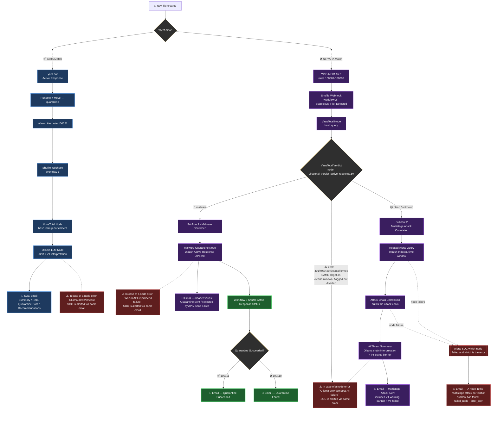

```mermaid
flowchart TD
    A[📁 New file created] --> B{YARA Scan}
    B --> LBL_NOMATCH(( )):::tiny
    B --> LBL_MATCH(( )):::tiny
    LBL_NOMATCH -.->|❌ No YARA Match| J
    LBL_MATCH -.->|✅ YARA Match| C

    %% ===== RIGHT BRANCH: WORKFLOW 2 - FIM / SUSPICIOUS FILE =====
    subgraph SG2[" "]
        direction TB
        J[Wazuh FIM Alert<br/>rules 100001-100008]
        J --> K[Shuffle Webhook<br/>Workflow 2 - Suspicious_File_Detected]
        K --> L[VirusTotal Node<br/>hash query]
        L --> M{VirusTotal Verdict<br/>node: virustotal_verdict_active_response.py}

        subgraph SG2B[" "]
            direction TB
            Q[Subflow 2<br/>Multistage Attack Correlation]
            Q --> R[Related Alerts Query<br/>Wazuh Indexer, time window]
            R --> S[Attack Chain Correlation<br/>builds the attack chain]
            S --> T[AI Threat Summary<br/>Ollama chain interpretation<br/>+ VT status banner]
            NOTE_T["⚠️ In case of a node error <br/> `Ollama down/timeout, VT failure` <br/> SOC is alerted via same email"]:::errorpath
            T -.- NOTE_T
            T --> U[📧 Email — Multistage Attack Alert<br/>includes VT warning banner if VT failed]
            
        end

        subgraph SG2A[" "]
            direction TB
            N[Subflow 1 - Malware Confirmed]
            N --> O[Malware Quarantine Node<br/>Wazuh Active Response API call]
            O --> P[📧 Email — header varies:<br/>Quarantine Sent / Rejected by API / Send Failed]
            O --> V[Workflow 3 Shuffle Active Response Status]
            V --> W{Quarantine Succeeded?}
            W -->|✅ 100111| X[📧 Email — Quarantine Succeeded]
            W -->|❌ 100110| Y[📧 Email — Quarantine Failed]
        
        end

        M -->|🔴 malware| N
        M -->|🟡 clean / unknown| Q
        M -->|⚠️ error — 401/403/429/5xx/malformed<br/>SAME target as clean/unknown, flagged not diverted| NOTE_T
    end

    %% ===== LEFT BRANCH: WORKFLOW 1 - YARA MATCH =====
    subgraph SG1[" "]
        direction TB
        C[yara.bat<br/>Active Response]
        C --> D[Rename + Move → quarantine]
        D --> E[Wazuh Alert rule 100021]
        E --> F[Shuffle Webhook<br/>Workflow 1]
        F --> G[VirusTotal Node<br/>hash lookup enrichment]
        G --> H[Ollama LLM Node<br/>alert + VT interpretation]
        H --> I[📧 SOC Email<br/>Summary / Risk / Quarantine Path / Recommendations]
        NOTE_H["⚠️ In case of a node error <br/> `Ollama down/timeout` <br/> SOC is alerted via same email"]:::errorpath
        H -.- NOTE_H
    end

    %% ===== ERROR ROUTING: NODE FAILURES INSIDE SUBFLOW 2 =====
    R -.->|node failure| ERR_ROUTER
    S -.->|node failure| ERR_ROUTER
    ERR_ROUTER[["Alerts SOC which node failed and which is the error"]]:::errorpath
    ERR_ROUTER --> ERR_EMAIL[📧 Email — 'A node in the multistage attack correlation<br/>subflow has failed: failed_node - error_text']:::errorpath

    NOTE_O["⚠️ In case of a node error <br/> `Wazuh API reject/send failure` <br/> SOC is alerted via same email"]:::errorpath
    O -.- NOTE_O

    classDef workflow1 fill:#1e3a5f,stroke:#4a9eff,color:#fff
    classDef workflow2 fill:#3a1e5f,stroke:#a44aff,color:#fff
    classDef workflow3 fill:#1e5f2e, stroke:#4aff6e,color:#fff
    classDef decision fill:#2f2f2f,stroke:#ffd24a,color:#fff
    classDef errorpath fill:#5f1e1e,stroke:#ff4a4a,color:#fff,stroke-dasharray: 3 3
    classDef invisible fill:none,stroke:none
    classDef tiny fill:none,stroke:none

    class C,D,E,F,G,H,I workflow1
    class J,K,L,N,O,P,Q,R,S,T,U workflow2
    class V,W,X,Y workflow3
    class B,M,W decision
    class SG1,SG2,SG2A,SG2B invisible
```
